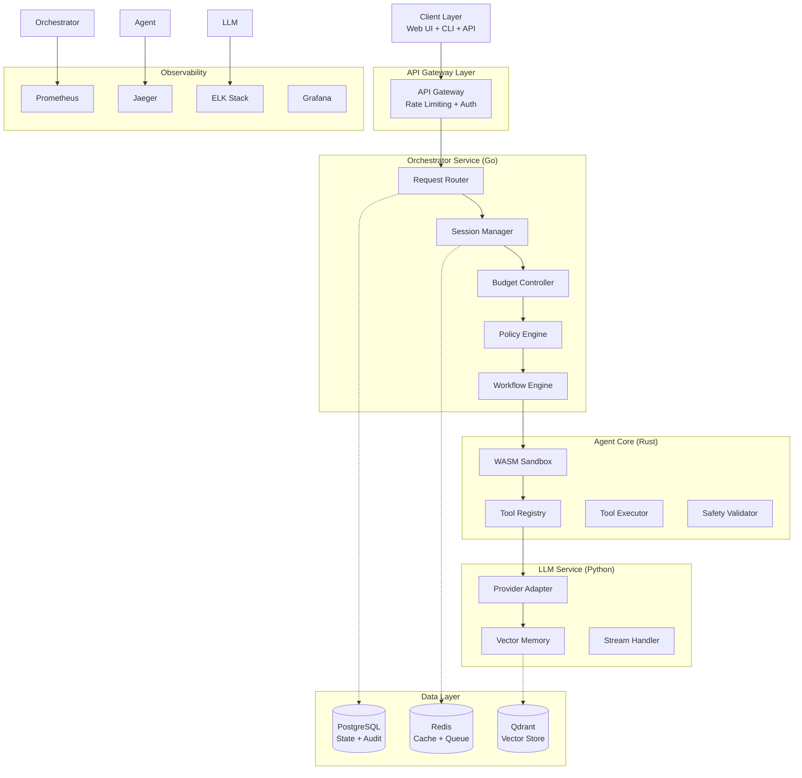

# Nexus Agent Platform - 架构设计文档

> **项目目标**: 构建一个企业级AI Agent平台，展示全栈技术能力，助力求职面试

## 🎯 求职导向的技术选型策略

### 核心展示能力
1. **系统架构设计** - 微服务、事件驱动、分布式系统
2. **多语言工程** - Go、Rust、Python的最佳实践
3. **云原生技术** - Docker、K8s、可观测性、CI/CD
4. **AI工程化** - LLM集成、向量检索、工具编排
5. **安全与治理** - 沙箱隔离、策略引擎、审计合规

### 技术亮点策略
- **Go**: 高并发orchestrator，展示goroutine、channel、微服务治理
- **Rust**: 安全沙箱agent-core，展示内存安全、性能优化、WASM
- **Python**: AI推理服务，展示异步编程、ML工程、FastAPI
- **架构**: 事件驱动、CQRS、分布式追踪、策略驱动

---

## 🏗️ 系统架构

### 整体架构图


### 核心数据流
```
用户请求 → API Gateway → Orchestrator → Agent Core → LLM Service
         ↓                    ↓             ↓
    预算检查 → 策略验证 → 工具执行 → 结果聚合 → 响应用户
         ↓                    ↓             ↓
    审计日志 → 指标收集 → 链路追踪 → 可观测性仪表盘
```

---

## 🎨 详细设计

### 1. Orchestrator Service (Go) - 核心编排层

**技术亮点**:
- 基于Go 1.21+，展示泛型、context、并发模式
- 事件驱动架构，使用channels和goroutines
- 插件化策略引擎，支持OPA集成

```go
// 核心接口设计
type Agent interface {
    ID() string
    Execute(ctx context.Context, req *AgentRequest) (*AgentResponse, error)
    Capabilities() []Capability
}

type PolicyEngine interface {
    Validate(ctx context.Context, req *PolicyRequest) (*PolicyResult, error)
    Rules() []Rule
}

type BudgetManager interface {
    Reserve(ctx context.Context, sessionID string, cost Cost) error
    Consume(ctx context.Context, sessionID string, actual Cost) error
    Remaining(ctx context.Context, sessionID string) (Cost, error)
}
```

**关键模块**:
- **Router**: HTTP路由、中间件链、请求分发
- **Session Manager**: 会话状态、上下文传递、生命周期
- **Budget Controller**: Token计费、时间限制、资源配额
- **Policy Engine**: 规则引擎、权限检查、合规审核
- **Workflow Engine**: 任务编排、状态机、重试补偿

**面试要点**:
- 展示Go并发模式：worker pool、fan-out/fan-in、pipeline
- 错误处理：wrap errors、circuit breaker、graceful degradation
- 可测试性：接口抽象、依赖注入、mock测试

### 2. Agent Core (Rust) - 安全执行层

**技术亮点**:
- Rust安全特性：所有权、生命周期、zero-cost abstraction
- WASM沙箱：wasmtime运行时，安全隔离
- 高性能工具执行：tokio异步运行时

```rust
// 核心trait设计
#[async_trait]
pub trait Tool: Send + Sync {
    fn name(&self) -> &str;
    fn schema(&self) -> ToolSchema;
    async fn execute(&self, input: Value) -> Result<Value, ToolError>;
    fn permissions(&self) -> Permissions;
}

pub struct ToolRegistry {
    tools: HashMap<String, Box<dyn Tool>>,
    sandbox: WasmSandbox,
}

pub struct WasmSandbox {
    engine: Engine,
    linker: Linker<()>,
    fuel_config: FuelConfig,
}
```

**关键模块**:
- **WASM Sandbox**: wasmtime集成、燃料限制、权限控制
- **Tool Registry**: 工具注册、版本管理、动态加载
- **Safety Validator**: 输入校验、输出过滤、恶意检测
- **Performance Monitor**: 资源监控、性能分析、瓶颈识别

**面试要点**:
- Rust内存安全：借用检查、生命周期、Send/Sync
- 异步编程：tokio runtime、async/await、stream处理
- WASM集成：安全沙箱、跨语言调用、性能优化

### 3. LLM Service (Python) - AI推理层

**技术亮点**:
- FastAPI + 异步编程，展示现代Python开发
- 多Provider抽象：OpenAI、Anthropic、本地模型
- 向量检索：embedding、semantic search、RAG

```python
# 核心抽象设计
class LLMProvider(Protocol):
    async def complete(self, messages: List[Message]) -> CompletionResult:
        ...
    
    async def stream(self, messages: List[Message]) -> AsyncIterator[StreamChunk]:
        ...
    
    async def embed(self, texts: List[str]) -> EmbeddingResult:
        ...

class VectorMemory:
    def __init__(self, qdrant_client: QdrantClient):
        self.client = qdrant_client
    
    async def store(self, session_id: str, content: str, metadata: Dict):
        ...
    
    async def search(self, session_id: str, query: str, limit: int = 10):
        ...
```

**关键模块**:
- **Provider Adapter**: 统一接口、负载均衡、failover
- **Vector Memory**: Qdrant集成、语义搜索、上下文检索
- **Stream Handler**: SSE流式输出、背压处理、连接管理
- **Content Filter**: 安全过滤、敏感信息检测、合规检查

**面试要点**:
- 异步编程：asyncio、async/await、并发控制
- ML工程化：模型管理、版本控制、A/B测试
- 性能优化：连接池、批处理、缓存策略

---

## 🗄️ 数据模型设计

### PostgreSQL Schema
```sql
-- 会话管理
CREATE TABLE sessions (
    id UUID PRIMARY KEY,
    user_id VARCHAR(255) NOT NULL,
    created_at TIMESTAMP WITH TIME ZONE DEFAULT NOW(),
    updated_at TIMESTAMP WITH TIME ZONE DEFAULT NOW(),
    status VARCHAR(50) NOT NULL DEFAULT 'active',
    budget JSONB NOT NULL, -- {tokens: 10000, time_seconds: 3600}
    policy_context JSONB, -- 策略上下文
    metadata JSONB
);

-- 消息历史
CREATE TABLE messages (
    id UUID PRIMARY KEY,
    session_id UUID NOT NULL REFERENCES sessions(id),
    role VARCHAR(50) NOT NULL, -- user, assistant, system, tool
    content TEXT NOT NULL,
    tokens INTEGER NOT NULL DEFAULT 0,
    created_at TIMESTAMP WITH TIME ZONE DEFAULT NOW(),
    metadata JSONB
);

-- Agent执行记录
CREATE TABLE agent_runs (
    id UUID PRIMARY KEY,
    session_id UUID NOT NULL REFERENCES sessions(id),
    status VARCHAR(50) NOT NULL, -- pending, running, completed, failed
    started_at TIMESTAMP WITH TIME ZONE DEFAULT NOW(),
    completed_at TIMESTAMP WITH TIME ZONE,
    cost JSONB NOT NULL, -- {tokens: 1500, time_ms: 5000}
    trace_id VARCHAR(255),
    error_message TEXT,
    metadata JSONB
);

-- 工具调用记录
CREATE TABLE tool_calls (
    id UUID PRIMARY KEY,
    run_id UUID NOT NULL REFERENCES agent_runs(id),
    tool_name VARCHAR(255) NOT NULL,
    tool_version VARCHAR(50) NOT NULL,
    input JSONB NOT NULL,
    output JSONB,
    latency_ms INTEGER,
    status VARCHAR(50) NOT NULL,
    error_message TEXT,
    created_at TIMESTAMP WITH TIME ZONE DEFAULT NOW()
);

-- 审计日志
CREATE TABLE audit_logs (
    id UUID PRIMARY KEY,
    user_id VARCHAR(255) NOT NULL,
    action VARCHAR(255) NOT NULL,
    resource_type VARCHAR(100) NOT NULL,
    resource_id VARCHAR(255),
    details JSONB,
    ip_address INET,
    user_agent TEXT,
    created_at TIMESTAMP WITH TIME ZONE DEFAULT NOW()
);
```

### Redis结构
```
# 会话缓存
session:${session_id} -> {user_id, status, budget, last_active}

# 预算缓存
budget:${session_id} -> {tokens_used, time_used, last_update}

# 任务队列
queue:agent_tasks -> [task_id1, task_id2, ...]

# 分布式锁
lock:session:${session_id} -> {holder, expires_at}

# 限流计数
ratelimit:${user_id}:${window} -> {count, expires_at}
```

### Qdrant集合
```python
# 向量集合配置
collections = {
    "session_memory": {
        "vectors": {
            "size": 1536,  # OpenAI embedding dimension
            "distance": "Cosine"
        },
        "payload_schema": {
            "session_id": "keyword",
            "user_id": "keyword", 
            "timestamp": "datetime",
            "content_type": "keyword",  # message, tool_result, summary
            "metadata": "text"
        }
    }
}
```

---

## 🔒 安全与治理

### 工具权限模型
```yaml
# 工具权限配置
tools:
  http_request:
    permissions:
      network:
        allowed_hosts: ["api.example.com", "*.safe-domain.com"]
        blocked_ips: ["127.0.0.1", "192.168.*", "10.*"]
        max_response_size: "10MB"
        timeout: "30s"
    
  file_system:
    permissions:
      paths:
        read: ["/tmp/agent-workspace/*"]
        write: ["/tmp/agent-workspace/output/*"]
        execute: []
      max_file_size: "5MB"
      allowed_extensions: [".txt", ".json", ".csv"]

  code_execution:
    permissions:
      languages: ["python", "javascript"]
      max_cpu_time: "10s"
      max_memory: "128MB"
      network_access: false
```

### 策略引擎集成
```rego
# OPA策略示例
package nexus.agent.policy

default allow = false

# 允许普通用户执行基础工具
allow {
    input.user.role == "user"
    input.tool.category in ["http", "text_processing", "data_analysis"]
    input.session.budget.tokens > 1000
}

# 管理员可以执行所有工具
allow {
    input.user.role == "admin"
}

# 敏感工具需要额外审批
allow {
    input.tool.category == "system"
    input.approval.status == "approved"
    input.approval.approver != input.user.id
}
```

---

## 🔍 可观测性设计

### OpenTelemetry集成
```go
// Go中的链路追踪
func (r *Router) HandleAgentRequest(w http.ResponseWriter, req *http.Request) {
    ctx := req.Context()
    span := trace.SpanFromContext(ctx)
    
    span.SetAttributes(
        attribute.String("session.id", sessionID),
        attribute.String("agent.type", agentType),
        attribute.Int("budget.tokens", budgetTokens),
    )
    
    // 传播到下游服务
    ctx = trace.ContextWithSpan(ctx, span)
    result, err := r.agentCore.Execute(ctx, agentReq)
    
    if err != nil {
        span.SetStatus(codes.Error, err.Error())
    }
}
```

### Prometheus指标
```go
// 关键业务指标
var (
    agentRequestsTotal = prometheus.NewCounterVec(
        prometheus.CounterOpts{
            Name: "nexus_agent_requests_total",
            Help: "Total number of agent requests",
        },
        []string{"session_id", "agent_type", "status"},
    )
    
    agentRequestDuration = prometheus.NewHistogramVec(
        prometheus.HistogramOpts{
            Name: "nexus_agent_request_duration_seconds",
            Help: "Agent request duration in seconds",
            Buckets: prometheus.DefBuckets,
        },
        []string{"agent_type"},
    )
    
    budgetUtilization = prometheus.NewGaugeVec(
        prometheus.GaugeOpts{
            Name: "nexus_budget_utilization_ratio",
            Help: "Budget utilization ratio (0-1)",
        },
        []string{"session_id", "resource_type"},
    )
)
```

### Grafana仪表盘
- **业务指标**: 请求量、成功率、用户活跃度、预算使用
- **性能指标**: 延迟分布、吞吐量、资源使用率
- **错误监控**: 错误率、失败类型、异常堆栈
- **成本分析**: Token消耗、API调用费用、资源成本

---

## 📈 实施路线图

### Phase 1: MVP (2-3周) - 核心功能闭环
- [x] 项目结构初始化
- [ ] Go Orchestrator基础框架
- [ ] Rust Agent Core工具执行
- [ ] Python LLM Service接口
- [ ] PostgreSQL数据模型
- [ ] Docker化部署
- [ ] 基础监控指标

### Phase 2: 增强功能 (2-3周) - 企业特性
- [ ] WASM沙箱集成
- [ ] OPA策略引擎
- [ ] Qdrant向量存储
- [ ] 完整链路追踪
- [ ] Grafana仪表盘
- [ ] 安全审计日志

### Phase 3: 生产就绪 (2-3周) - 运维优化
- [ ] Kubernetes部署
- [ ] CI/CD流水线
- [ ] 压力测试报告
- [ ] 故障注入测试
- [ ] 性能调优文档
- [ ] 运维手册

### Phase 4: 高级特性 (可选) - 技术亮点
- [ ] 多租户支持
- [ ] 自动扩缩容
- [ ] 成本优化引擎
- [ ] 智能路由
- [ ] 边缘计算集成

---

## 🎤 面试演示策略

### 技术深度展示
1. **架构设计**: 从单体到微服务的演进思路
2. **并发处理**: Go goroutine pool、Rust tokio、Python asyncio
3. **安全隔离**: WASM沙箱原理、权限控制机制
4. **性能优化**: 缓存策略、连接复用、批处理优化
5. **可观测性**: 分布式追踪、指标采集、异常监控

### 问题解决能力
- **扩展性**: 如何支持千万级并发、百万级用户
- **可靠性**: 故障隔离、优雅降级、数据一致性
- **安全性**: 输入验证、权限控制、审计合规
- **成本控制**: 资源优化、计费精确性、预算管理

### 业务理解
- **AI Agent场景**: 为什么选择这个技术方案
- **企业需求**: 安全、合规、成本、性能的权衡
- **产品思维**: 从技术特性到业务价值的映射

---

## 📚 学习资源推荐

### 系统设计
- 《设计数据密集型应用》- 分布式系统基础
- 《微服务架构设计模式》- 服务治理
- 《云原生应用架构指南》- K8s生态

### 编程语言
- **Go**: 《Go语言圣经》、Go并发编程模式
- **Rust**: 《Rust权威指南》、异步编程实践
- **Python**: FastAPI文档、异步最佳实践

### AI工程
- LangChain架构分析
- Vector Database对比
- LLM部署优化

---

*此文档将持续更新，记录技术选择的思考过程和实现细节，作为面试时的技术展示材料。*
